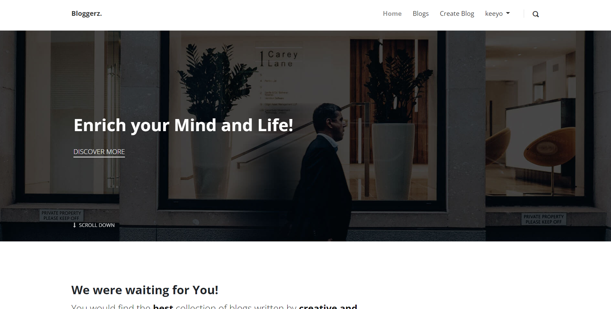

# Django Blog Application

A Django based Web Application

## Introduction
This is the web application made using Django. It is blogging site which enables its users to read and create blogs.

## Key Features
* Use of django-authentication for user login.
* User can create, read, update or delete their blogs.
* Users can post comments on blogs.
* Used Bootstrap Template in the frontend
* Handled media files so that user can upload their profile pic as well as add image in blog.

## Technologies Used

* Django (backend)
* Bootstrap template (frontend)
* SQLite (database)

## Demo Video

## Author
* LinkedIn: [@Prashant Kumar](https://www.linkedin.com/in/prashant-kumar-7aa9a4203/)
* Email: [@prashant](mailto:prashantrkt2002@gmail.com)
* Github: [@prashantpks](https://github.com/prashantpks/)

